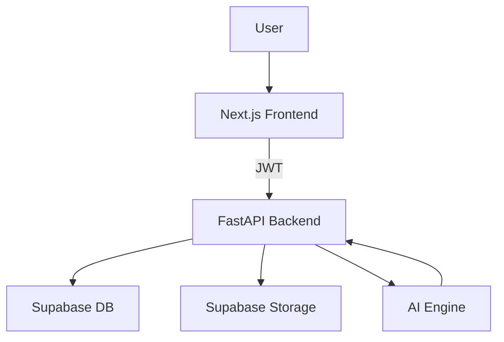

<!-- HEADER -->

<h1 align="center">🚀 ALIA – AI Life Admin Assistant</h1>

<p align="center">
  <b>Turn your life into a structured, AI-powered system</b>
</p>

<p align="center">
  
</p>

<p align="center">
  
  
  
</p>

---

## 🌐 Live Demo

🚧 **Deployment in progress**

This project is currently not publicly deployed.
Run locally using the setup guide below.

---

## 📸 Screenshots

<p align="center">
  
  
</p>

<p align="center">
  
  
</p>
---

## ✨ Overview

ALIA is a **full-stack AI productivity system** that transforms unstructured input into actionable workflows.

Instead of managing tasks manually, ALIA helps you:

* Extract tasks automatically using AI
* Organize and prioritize intelligently
* Track progress with gamification
* Receive daily structured insights

---

## 🔥 Core Features

| Feature            | Description                                   |
| ------------------ | --------------------------------------------- |
| 🧠 AI Extraction   | Converts raw text/files into structured tasks |
| ✅ Task Manager     | Full CRUD operations for tasks                |
| 📊 Gamification    | XP, streaks, levels                           |
| 📅 Smart Briefings | Daily AI-generated summaries                  |
| 📁 File System     | Source file tracking                          |
| 🔐 Auth            | Secure login via Supabase                     |

---

## 🏗️ System Architecture



---

## ⚡ Tech Stack

<p align="center">
  
</p>

---

## 📁 Project Structure

```bash
ALIA/
├── alia-backend/
├── life-admin/
├── supabase/
└── README.md
```

---

## ⚙️ Setup Guide

### 🔙 Backend

```bash
cd alia-backend
copy .env.example .env
py -3.11 -m venv venv
.\venv\Scripts\python.exe -m pip install -r requirements.txt
.\venv\Scripts\python.exe -m uvicorn app.main:app --reload --port 8000
```

---

### 🌐 Frontend

```bash
cd life-admin
copy .env.local.example .env.local
npm install
npm run dev
```

👉 http://localhost:3000

---

## 🔑 Environment Variables

### Backend

* SUPABASE_URL
* SUPABASE_SERVICE_ROLE_KEY

### Frontend

* NEXT_PUBLIC_SUPABASE_URL
* NEXT_PUBLIC_SUPABASE_ANON_KEY

⚠️ Never commit secrets

---

## 📡 API Highlights

| Endpoint      | Purpose         |
| ------------- | --------------- |
| /tasks        | Task management |
| /ai/extract   | AI processing   |
| /files        | File handling   |
| /gamification | XP system       |
| /briefings    | Daily insights  |

---

## 🎯 Why This Project Stands Out

* Full-stack AI system (not just UI demo)
* Real-world usable architecture
* Combines productivity + AI + gamification
* Clean separation of frontend & backend
* Scalable design

---

## 🚀 Roadmap

* 🔔 Smart notifications
* 📱 Mobile application
* 🤖 Advanced AI workflows
* 📊 Analytics dashboard

---

## 👨‍💻 Developer Note

This is a **real MVP system**, not a toy project.
If something breaks, fix your environment before blaming the code.

---

## ⭐ Support

<p align="center">
  If you found this project useful, consider giving it a ⭐
</p>
