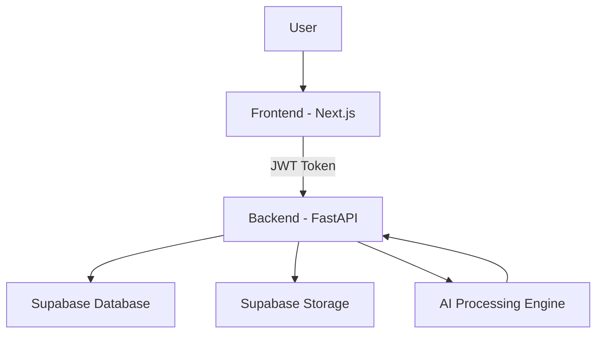

<h1 align="center">🚀 ALIA – AI Life Admin Assistant</h1>

<p align="center">
  <b>AI-powered life management system that turns chaos into structure</b>
</p>

<p align="center">
  
  
  
</p>

---


## 🌐 Live Demo

🚧 **Deployment in progress**

This project is currently not publicly deployed.

You can run it locally by following the setup instructions below.

👉 Demo will be available soon.


## 📸 Screenshots

> ⚠️ Replace these with your real screenshots

<p align="center">
  
  
  
  
</p>

---

## ✨ Overview

ALIA (AI Life Admin Assistant) is a full-stack AI productivity system that helps users:

* Extract tasks from text/files using AI
* Manage daily workflow efficiently
* Track progress using gamification
* Get intelligent daily briefings

---

## 🔥 Core Features

* 🧠 AI Task Extraction Engine
* ✅ Full Task Management System
* 📊 XP, Levels & Streak Tracking
* 📅 Daily Smart Briefings
* 📁 File Processing & Tracking
* 🔐 Secure Auth (Supabase)

---

## 🏗️ Architecture



---

## 🛠️ Tech Stack

| Layer    | Tech                    |
| -------- | ----------------------- |
| Frontend | Next.js, TypeScript     |
| Backend  | FastAPI, Python         |
| Database | Supabase (PostgreSQL)   |
| Storage  | Supabase Storage        |
| AI       | Custom extraction logic |
| Email    | Resend                  |

---

## 📁 Project Structure

```bash
ALIA/
├── alia-backend/
├── life-admin/
├── supabase/
└── README.md
```

---

## ⚙️ Setup Guide

### 🔙 Backend

```bash
cd alia-backend
copy .env.example .env
py -3.11 -m venv venv
.\venv\Scripts\python.exe -m pip install -r requirements.txt
.\venv\Scripts\python.exe -m uvicorn app.main:app --reload --port 8000
```

---

### 🌐 Frontend

```bash
cd life-admin
copy .env.local.example .env.local
npm install
npm run dev
```

👉 Open http://localhost:3000

---

## 🔑 Environment Variables

### Backend

* SUPABASE_URL
* SUPABASE_SERVICE_ROLE_KEY

### Frontend

* NEXT_PUBLIC_SUPABASE_URL
* NEXT_PUBLIC_SUPABASE_ANON_KEY

⚠️ Never commit secrets

---

## 📡 API Highlights

| Endpoint      | Purpose        |
| ------------- | -------------- |
| /tasks        | Manage tasks   |
| /ai/extract   | AI extraction  |
| /files        | File handling  |
| /gamification | XP system      |
| /briefings    | Daily briefing |

---

## 🎯 Why This Project Stands Out

* Combines **AI + productivity + gamification**
* Real-world usable system (not just demo)
* Full-stack architecture (frontend + backend + DB)
* Clean API design with authentication
* Scalable structure for future expansion

---

## 🚀 Future Improvements

* 🔔 Smart notifications
* 📱 Mobile app
* 🤖 Advanced AI workflows
* 📊 Analytics dashboard

---

## 👨‍💻 Developer Notes

This project is built as a real-world MVP system.
If something fails, debug your environment setup before assuming code issues.

---

## ⭐ Support

If you found this useful, consider giving it a star ⭐

---
