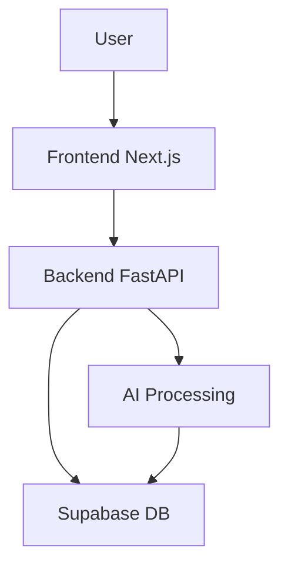

<!-- HEADER -->

<h1 align="center">🚀 ALIA – AI Life Admin Assistant</h1>

<p align="center">
  <b>Your smart AI-powered life inbox</b><br>
  Manage tasks • Extract actions • Stay productive
</p>

<p align="center">
  
  
  
</p>

---

<!-- HERO GIF -->

<p align="center">
  
</p>

---

## ✨ What is ALIA?

ALIA (AI Life Admin Assistant) is a full-stack AI-powered productivity system that turns your life into a structured, manageable workflow.

> Think: Notion + AI + Task Manager + Gamification — all in one.

---

## 🔥 Features

* 🧠 AI Task Extraction (from text/files)
* ✅ Task Management System
* 📊 Gamification (XP, levels, streaks)
* 📅 Daily Smart Briefings
* 📁 File Processing System
* 🔐 Secure Authentication (Supabase)

---

## 🛠️ Tech Stack

<p align="center">


</p>

---

## 🧩 Project Structure

```bash
ALIA/
├── alia-backend/
├── life-admin/
├── supabase/
└── README.md
```

---

## ⚙️ Setup Guide

### 🔙 Backend (FastAPI)

```bash
cd alia-backend
copy .env.example .env
py -3.11 -m venv venv
.\venv\Scripts\python.exe -m pip install -r requirements.txt
```

Run:

```bash
.\venv\Scripts\python.exe -m uvicorn app.main:app --reload --port 8000
```

---

### 🌐 Frontend (Next.js)

```bash
cd life-admin
copy .env.local.example .env.local
npm install
npm run dev
```

Open:
👉 http://localhost:3000

---

## 🔑 Environment Variables

### Backend

* Supabase URL
* Service Role Key
* AI / Email keys

### Frontend

* Supabase URL
* Anon Key

⚠️ Never commit real `.env` files

---

## 📡 API Overview

```bash
/api/v1/
```

| Endpoint      | Description    |
| ------------- | -------------- |
| /tasks        | Manage tasks   |
| /ai/extract   | AI extraction  |
| /files        | File system    |
| /gamification | XP system      |
| /briefings    | Daily insights |

---

## 🧠 How It Works



---

## 🧪 Verify Setup

```bash
npm run build
npm run lint
```

---

## 🔐 Security

* 🔒 Supabase Auth verification
* 🚫 No `.env` exposure
* 🔁 Rotate keys if leaked

---

## 🚀 Future Plans

* 📱 Mobile app
* 🔔 Notifications
* 🤖 Advanced AI automation
* 📊 Analytics dashboard

---

## 💡 Final Note

If this project looks complex, that’s because it is.

But once it runs — it becomes your personal AI system.

---

<p align="center">
  ⭐ Star this repo if you found it useful
</p>
